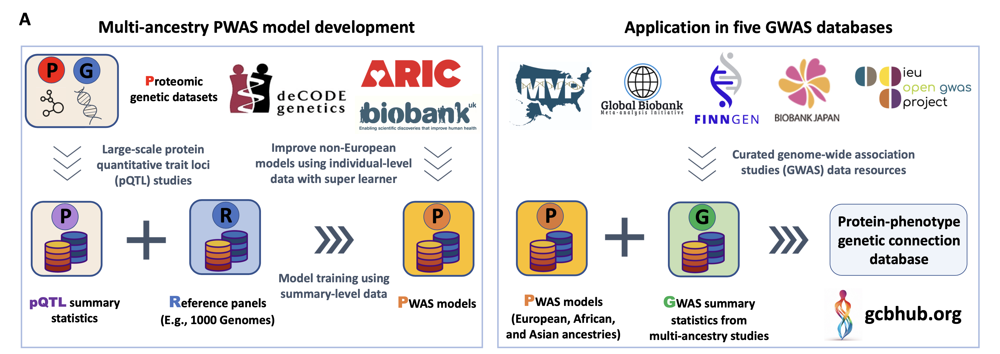

# BLISS

We introduced **Biomarker expression Level Imputation using Summary-level Statistics (BLISS)**, a novel method designed for developing protein imputation models using summary-level pQTL data. This software is to support our [gcb-hub](http://www.gcbhub.org) (see figure below) and creating large-scale imputations models for multi-ancestry proteome-wide association analysis. 




## Installation

There are two ways to install BLISS:

### Option 1: Stable Release. 
Download the stable version (V1.0) of BLISS, along with all related data, from gcb-hub eith using this [link](https://gcbhub.s3.us-east-2.amazonaws.com/BLISS.zip) or

```
wget -c https://gcbhub.s3.us-east-2.amazonaws.com/BLISS.zip
unzip BLISS.zip
cd BLISS
```

### Option 2: Latest Release

For the most up-to-date version of BLISS, you can download and unpack the repository from this GitHub page, then put the updated codes into the BLISS directory:

```
wget https://github.com/gcb-hub/BLISS/archive/refs/heads/main.zip
```


### Pre-requisite (Install neccessary R Packages)

Open R and install the necessary packages by running the following codes. 
```
packages_to_install <- c("data.table", "BEDMatrix", "dplyr", "MASS","optparse")

# Loop through each package and install if not already installed
for (pkg in packages_to_install) {
  if (!requireNamespace(pkg, quietly = TRUE)) {
    install.packages(pkg)
  }
}
```

## Typical analysis and outputs

BLISS performs analyses by combining user-specified protein expression prediction models with GWAS summary statistics to identify significant gene-trait associations. We offer six pre-built sets of protein imputation models tailored for various platforms and ancestries. Users only need to provide GWAS summary data and specify the imputation models to be used.

### Input: GWAS summary statistics

GWAS summary statistics must be formatted as a flat file with the following mandatory columns:

1. CHROMOSOME - chromosome id
2. SNP – SNP identifier (rsID)
3. A1 – other allele, also sometimes called  non-effect allele 
4. A2 – effective allele, also sometimes called risk allele or coding allele
5. Z – Z-scores, **sign with respect to A2**

We also strongly recommend including one optional column:

6. N - sample size, which is often the discovery stage sample size, not maximum sample size


As an example, we offer [processed stroke GWAS summary data from the GBMI](https://www.dropbox.com/scl/fi/yeh0g0ek6vis9suhonjfg/Stroke_eur_GBMI_CHR22.sumstats?rlkey=9wsxglhz5chasy2lowvlb2rjy&dl=0), limited to chromosome 22 for illustration purposes. Please create a `sum_dat` folder and put the downloaded `Stroke_eur_GBMI_CHR22.sumstats` into the `sum_dat` folder. The full raw dataset can be downloaded from the [GBMI Resources Page](https://www.globalbiobankmeta.org/resources).

**Recommendation:** We strongly advise using our interactive quality control tool (`APSS.R`) or other qc tools before running `BLISS_Association.R`. While our software is designed for robustness, automatically calculating Z-scores and adopting common column names for chromosome, SNP, Z, and N, we intentionally leave the A1 and A2 columns unchecked. This emphasizes the critical need to accurately specify the effective allele (A2) and the other allele (A1) for reliable results. If A1 and A2 are misspecified, the effect direction will be opposite.

**Note:** We use SNP (rsID) to map GWAS summary statistics, LD reference panel, and protein prediction models.

**Note:** Similar to TWAS, our approach requires comprehensive summary-level data without significance thresholding (i.e., raw, quality-controlled GWAS data). This ensures that most SNPs used for protein expression prediction are present in the GWAS summary statistics. 

### Identifying protein-trait associations

To identify protein-trait associations, execute the `BLISS_Association.R` script using data for chromosome 22 as shown below:

```
Rscript BLISS_Association.R \
--sumstats Stroke_eur_GBMI_CHR22.sumstats \
--sumstats_dir sum_dat/ \
--weights_models UKB \
--CHR 22 \
--output_dir results/ \
--output_name stroke_res_CHR22.txt
```

This analysis should take approximately about five seconds to complete. Log information will be displayed on the screen. Upon successful execution, a file named stroke_res_CHR22.txt will be generated, containing 48 rows. Detailed descriptions of the outputs will follow.

Internally, the script performs these tasks: (1) unify the GWAS and reference SNPs and remove/flip alleles as needed; (2) test protein-trait associations; (3) estimate the effect sizes and their standard errors; and (4) report results.

### Parameters

Here are the revised parameters for `BLISS_Association.R`:

| Flag             | Value                          | Description                                                  |
| ---------------- | ------------------------------ | ------------------------------------------------------------ |
| --sumstats       | Stroke_eur_GBMI_CHR22.sumstats | The processed GWAS summary data                              |
| --sumstats_dir   | sum_dat/                       | Directory where `sumstats` is stored                         |
| --weights_models | UKB                            | The BLISS protein prediction models to be used (refer to the Protein Expression Imputation Models section for details) |
| --CHR            | 22                             | Chromosome to be analyzed                                    |
| --output_dir     | results/                       | Directory for storing the output files                       |
| --output_name    | stroke_res_CHR22.txt           | Name of the output file                                      |


### Output: Protein-trait association
Here’s how to interpret the results in `stroke_res_CHR22.txt`. The table below displays the first two lines of the output file, transposed for explanation:

| Column        | Value    | Explain                                                      |
| ------------- | -------- | ------------------------------------------------------------ |
| chr           | 22       | Chrosome ID                                                  |
| p0            | 17659680 | Gene start                                                   |
| p1            | 17739125 | Gene end                                                     |
| gene          | ADA2     | Protein name                                                 |
| R2            | 0.044    | Predicitve R2 provided by weights                            |
| Zcore.classic | -0.866   | Z score using standard PWAS method                           |
| p.classic     | 0.386    | Standard PWAS p value                                        |
| beta_BLISS    | -0.003   | Estimated effect size from BLISS (recommend using this)      |
| se_BLISS      | 0.003    | Standard error of effect size from BLISS (recommend using this) |
| p_BLISS       | 0.386    | BLISS p value (recommend using this)                         |
| n_used_snp    | 118      | Number of SNPs used in PWAS models                           |
| n_snp         | 151      | Total number of SNPs in PWAS models                          |


## Protein expression imputation models

We offer protein expression imputation models across various platforms and ancestries. The table below summarizes the available models. We provide all available models we have trained to advocate open science, however we only recommend using models with estimated hertibability exceeding 0.01 as analyzed in our manuscript:

| Name          | Platform | Method                | Ancestry         | Training Sample size | \# proteins |
| ------------- | -------- | --------------------- | ---------------- | -------------------- | ----------- |
| UKB           | OLink    | BLISS                 | EUR              | 46,066               | 1,412       |
| ARIC          | SomaScan | BLISS                 | EUR              | 7,213                | 4,423       |
| deCODE        | SomaScan | BLISS                 | EUR              | 35,559               | 4,428       |
| UKB_AFR_std   | OLink    | Standard PWAS         | AFR              | 1,171                | 1,412       |
| UKB_AFR_super | OLink    | BLISS (Super Learner) | AFR              | 1,171                | 1,412       |
| ARIC_AA       | SomaScan | BLISS                 | African American | 1,871                | 4,415       |
| UKB_ASN_std   | OLink    | Standard PWAS         | Asian            | 914                  | 1,412       |
| UKB_ASN_super | OLink    | BLISS (Super Learner) | Asian            | 914                  | 1,412       |


## FAQ

For any questions, please raise an issue on GitHub (recommended) or email us. We typically respond within a few hours.


1. **How Can Z-Scores Be Calculated Using a Downloaded GWAS Summary Statistics File?**

   We offer a script called `APSS.R` designed to preprocess the GWAS summary statistics file. If the file includes both the effect size (BETA) and standard error (SE), you can calculate the Z-score using the formula $Z = BETA/SE$. Should the file provide odds ratios, the effect size can be determined by taking the natural logarithm of the odds ratio. Additionally, our primary script `BLISS_Association.R` incorporates these calculations to ensure smooth execution of the analysis.

2. **How to deal with the error message: Currently, we provide the following models: ARIC, ARIC_AA, deCODE, UKB, UKB_AFR_std, UKB_AFR_super, UKB_ASN_std, UKB_ASN_super. Please specify your choice for weights_models by selecting one of these available options"**

   If you do specify the weights_models to one of the above models we provided, please make sure there is no additional lines between each option when running  `Rscript BLISS_Association.R` to make sure that R read every option correctly.

3. **Why I got the warnings like "replacement element 1 has 2 row to replace 1 rows?"**

   This is becuase the GWAS summary data have not been properly processed. Please use `APSS.R` to pre-process the GWAS summary data to make the results robustly.


### Change log

10-03-2023: First version release

### Citation

If you find our resources helpful, please cite the following manuscript:

**[Large-scale imputation models for multi-ancestry proteome-wide association analysis](https://doi.org/10.1101/2023.10.05.561120)**, Biorxiv


### License
This work is licensed under the [CC BY-NC-ND 4.0 DEED](https://creativecommons.org/licenses/by-nc-nd/4.0/).
