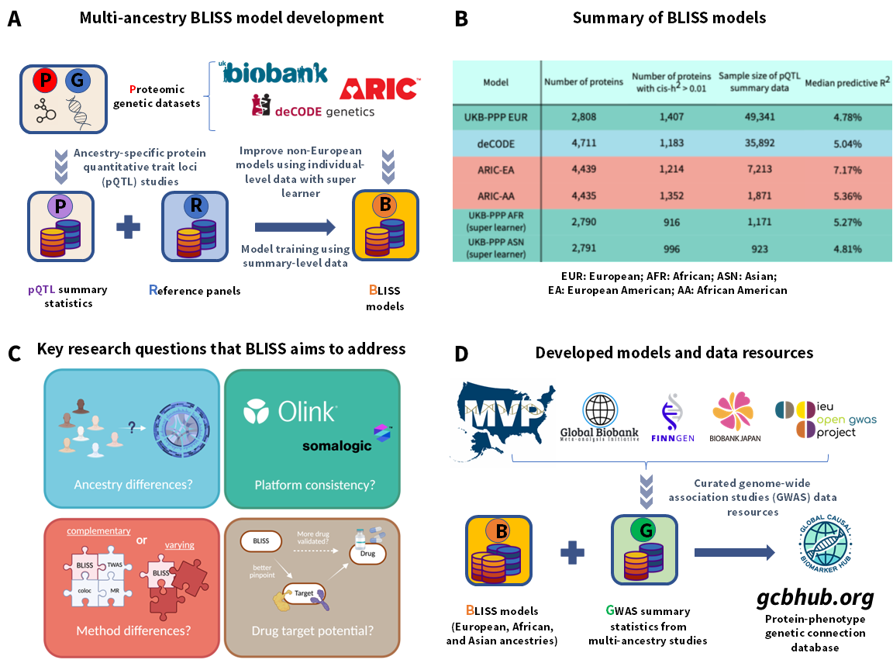

# BLISS

We introduced **Biomarker expression Level Imputation using Summary-level Statistics (BLISS)**, a novel method designed for developing protein imputation models using summary-level pQTL data. This software supports our [GCB Hub](http://www.gcbhub.org) and facilitates researchers to conduct their own proteome-wide association studies (PWAS).



## Installation

### Code
Simply clone from our GitHub repo to get the up-to-date version:

```bash
git clone https://github.com/gcb-hub/BLISS.git
```

### Model files
Download our pre-constructed model and LD matrix files from our 🤗 Hugging Face repo and place them in the appropriate directory:

```bash
cd BLISS

# Download model
mkdir model && cd model
wget https://huggingface.co/datasets/chongwulab/BLISS-models/resolve/main/UKBPPP_EUR.zip
unzip UKBPPP_EUR.zip
cd ..

# Download example GWAS data
wget https://gcbhub.s3.us-east-2.amazonaws.com/example.zip && unzip example.zip
```

For more models, please refer to our [🤗 Hugging Face repo page](https://huggingface.co/datasets/chongwulab/BLISS-models) and get the needed download links. 

## Data preprocessing

### Quality control recommendations

We strongly advise using quality control tools before running the main analysis:

1. **Use our QC tool:** Run `APSS.R` for interactive quality control
2. **Check allele specifications:** Ensure A1 and A2 are correctly specified
3. **Verify Z-score calculations:** If Z-scores are missing, they can be calculated as Z = BETA/SE
4. **Handle missing data:** Remove or impute missing values appropriately

### Z-Score calculation

If your GWAS summary statistics include BETA and SE columns but lack Z-scores:

```r
# Z-score calculation
Z = BETA / SE

# For odds ratios, first convert to log scale
BETA = log(OR)
Z = BETA / SE
```
## Typical analysis and outputs

BLISS performs analyses by combining user-specified protein expression prediction models with GWAS summary statistics to identify significant protein-trait associations. We offer multiple pre-built sets of protein imputation models tailored for various proteomic platforms and ancestries. Users only need to provide GWAS summary data and specify the imputation models to be used.

### Input: GWAS summary statistics

GWAS summary statistics must be formatted as a flat file with the following mandatory columns:

1. **CHR** - chromosome ID
2. **SNP** - SNP identifier (rsID)
3. **A1** - effect allele (effect/risk/coding allele)
4. **A2** - other allele (non-effect allele)
5. **Z** - Z-scores, **sign with respect to A1**

We also strongly recommend including one optional column:

6. **N** - sample size (discovery stage sample size, not maximum sample size)

**Note:** Column names are case-sensitive. Make sure your input file uses the exact column names listed above.

## Data preprocessing

### Quality control recommendations

We strongly advise using quality control tools before running the main analysis:

1. **Use our QC tool:** Run `APSS.R` for interactive quality control
2. **Check allele specifications:** Ensure A1 and A2 are correctly specified
3. **Verify Z-score calculations:** If Z-scores are missing, they can be calculated as Z = BETA/SE
4. **Handle missing data:** Remove or impute missing values appropriately

### Z-Score calculation

If your GWAS summary statistics include BETA and SE columns but lack Z-scores:

```r
# Z-score calculation
Z = BETA / SE

# For odds ratios, first convert to log scale
BETA = log(OR)
Z = BETA / SE
```

### Running BLISS association analysis

To identify protein-trait associations, use the main analysis script. Here's an example using stroke GWAS data (included in our S3 bucket):

```bash
Rscript BLISS_Association.R \
  --path_sumstats example/RandomGWAS_chr12.sumstats \
  --n 300000 \
  --model UKBPPP_EUR \
  --chr 12 \
  --output_dir results/ \
  --output_name result_RandomGWAS_chr12.txt \
  --output_augmented TRUE \
  --output_twas_fusion FALSE \
  --clean_slate FALSE \
```

### Parameters

| Parameter | Type | Description | Default |
|-----------|------|-------------|---------|
| `path_sumstats` | string | Path to the processed GWAS summary statistics file | Required |
| `n` | numeric | Sample size of GWAS (if not provided in N column) | Optional |
| `model` | string | Protein prediction model to use | UKBPPP_EUR |
| `chr` | numeric | Specific chromosome to analyze (1-22) | All chromosomes |
| `output_dir` | string | Directory to store output files | Current directory |
| `output_name` | string | Name of the output file | PWAS_results |
| `output_augmented` | logical | Output augmented results with additional annotations | FALSE |
| `output_twas_fusion` | logical | TWAS-FUSION-style output | FALSE |
| `clean_slate` | logical | Discard unfinished result and start fresh? | FALSE |

### Output: Protein-trait association results

The output file contains the following columns:

| Column | Description |
|--------|-------------|
| `protein` | Protein name/identifier |
| `beta` | Estimated effect size (recommended for interpretation) |
| `se` | Standard error of the effect size |
| `p` | P-value for the protein-trait association |
| `model_r2` | Predictive R² of the protein expression model |
| `n_snps` | Number of SNPs used in the protein prediction model |
| `MHC` | Indicator for MHC region (major histocompatibility complex) |

When `--output_augmented TRUE` is specified, additional columns are included:

- `filename`: Model filename used
- `chromosome`: Chromosome location
- `start`: Gene start position
- `end`: Gene end position  
- `q`: FDR-adjusted p-values

## Available protein expression imputation models

We provide protein expression imputation models across various platforms and ancestries:

| Model Name | Platform | Method | Ancestry | Training Sample Size | Number of proteins | Number of proteins with _cis_-$h^2$ > 0.01 |
|------------|----------|---------|----------|---------------------|--------------------|--------------------------------------------|
| UKBPPP_EUR | Olink | BLISS | European | 49,341 | 2,808 | 1,407 |
| UKBPPP_AFR | Olink | BLISS | African | 1,181 | 2,790 | 916 |
| UKBPPP_ASN | Olink | BLISS | Asian | 923 | 2,791 | 996 |
| deCODE | SomaScan | BLISS | European (Icelandic) | 35,892 | 4,711 | 1,183 |
| ARIC_EA | SomaScan | BLISS | European American | 7,213 | 4,439 | 1,214 |
| ARIC_AA | SomaScan | BLISS | African American | 1,181 | 4,435 | 1,352 |


**Recommendation:** Although we are providing you with results for all the available proteins, we recommend using models **with estimated heritability exceeding 0.01 as analyzed in our manuscript**.

## Advanced usage

### Output state management

The script automatically handles interrupted runs:
- Creates `.finished` files upon completion
- Can resume from interruption points
- Use `--clean_slate TRUE` to start fresh

## FAQ

**Q: How do I calculate Z-scores from my GWAS summary statistics?**

A: Use our `APSS.R` script for preprocessing, or calculate manually: Z = BETA/SE. For odds ratios, first take the natural logarithm: BETA = log(OR), then Z = BETA/SE.

**Q: What if I get "model not found" errors?**

A: Ensure model files are properly downloaded and placed in the `model/` directory. Each model must have a corresponding `.manifest` file.

**Q: Why do I get warnings about replacement elements?**

A: This typically indicates improperly formatted GWAS summary data. Use `APSS.R` to preprocess your data for robust results.

**Q: Can I analyze a specific chromosome only?**

A: Yes, use the `--chr` parameter to specify a single chromosome (1-22). Omit this parameter to analyze all chromosomes.

**Q: How do I interpret the MHC column?**

A: The MHC column indicates whether the protein/gene is located in the major histocompatibility complex region, which may require special consideration due to its unique linkage disequilibrium patterns.

**Q: Can I extract the LD matrices?**

A: Load the model file of interest and use the ``recover_corr_matrix`` function from ``BLISS_Association.R``.

```R
load("PROTEIN_OF_INTEREST.RData")
matrix.LD <- recover_corr_matrix(matrix.LD)
```

## Troubleshooting

**Common Issues:**

1. **File path errors:** Ensure all file paths are correct and files exist
2. **Memory issues:** For large datasets, consider processing chromosome by chromosome
3. **Column naming:** Verify that input files use exact column names (case-sensitive)
4. **Sample size:** Provide sample size via `--n` if not available in the N column

## Citation

If you find our resources helpful, please cite:

**[Large-scale imputation models for multi-ancestry proteome-wide association analysis](https://doi.org/10.1101/2023.10.05.561120)**, bioRxiv

## License

This work is licensed under the [CC BY-NC-ND 4.0 DEED](https://creativecommons.org/licenses/by-nc-nd/4.0/).

## Support

For questions or issues:
- **GitHub Issues:** [Recommended] Submit issues on our GitHub repository
- **Email:** Contact us directly

We typically respond within a few hours.

---

### Change Log

- **10-03-2023:**<br>
First version release

- **07-27-2025:**<br>
Added multi-ancestry support with UKBPPP_AFR and UKBPPP_ASN models.<br>
Enhanced parameter structure with augmented output options and TWAS-FUSION compatibility.<br>
Added deCODE (SomaScan) and ARIC models for expanded platform coverage.<br>
Documentation update - Added LD matrix extraction guide, improved FAQ section, and clarified QC recommendations
